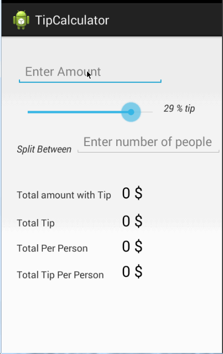

android-tip-calculator
======================

Tip Calculator App

[Done]    User is displayed the tip of specified percentage for specified entered amount

[Done]    User enters the total amount of the transaction

[Done]    User can select between tip amounts (i.e 10%, 15%, 20%)

[Done]    Upon selecting tip amount, formatted tip value is displayed

    
[Done]    Optional: User changes the total amount and updated tip is reflected automatically

[Done]    Optional: User can select custom tip percentage if desired

[Done]    Optional: User can select how many ways to split the tip

[Done]    Optional: User can edit preset tip percentages and have them persist across launches

[Not Done]    Optional: Experiment with trying input widgets to replace the buttons and/or textviews

[Not Done]    Optional: Improve the user interface and experience by using images and/or colors

GIF created with [LiceCap](http://www.cockos.com/licecap/).
